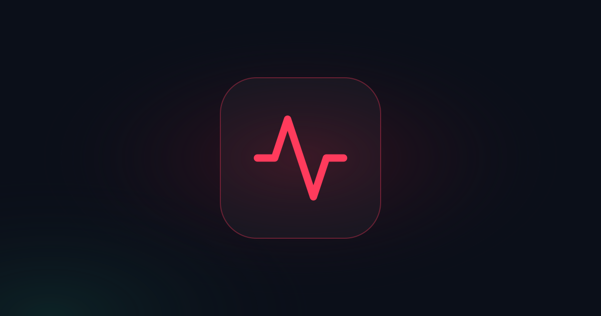

# 🩺 Anesthesia Puzzle Game (پازل بیهوشی)

An interactive, gamified learning tool that helps medical, nursing, and anesthesia-technology students practice core clinical anesthesia workflows through puzzle-style challenges — built entirely with vanilla HTML, CSS, and JavaScript.

🔗 **Live demo:** [Add your GitHub Pages / Vercel link here]



## ✨ Features

- **8 clinical challenge modules**, each modeling a real anesthesia scenario:
  - Airway Anatomy
  - Induction (RSI)
  - Spinal Anesthesia
  - Anesthesia Machine Circuit
  - Emergency Drugs & CPR
  - Reversal & Emergence
  - Malignant Hyperthermia
  - IV Access Procedure
- **Player accounts & progress tracking** — phone-based login with per-player saved progress, streaks, and coins
- **XP, achievements, and daily rewards** to keep learners engaged
- **Avatar customization** with unlockable frames
- **Global leaderboard** backed by [Supabase](https://supabase.com) (Postgres + RPC functions)
- **Admin panel** (`admin.html`) for reviewing player activity and error logs
- **Sound settings & onboarding flow** for first-time users
- Fully responsive, mobile-friendly UI in Persian (فارسی)

## 🛠️ Tech Stack

| Layer | Technology |
|---|---|
| Frontend | HTML5, CSS3, vanilla JavaScript (no framework) |
| Backend / Data | [Supabase](https://supabase.com) (Postgres, RPC, Row Level Security) |
| Client storage | `localStorage` for offline progress caching |
| Hosting | Static hosting (GitHub Pages compatible) |

## 📁 Project Structure

```
anesgame/
├── index.html        # Main game shell, levels, modals, onboarding
├── minigame.html      # Standalone mini-game mode
├── leaderboard.html   # Public leaderboard view
├── admin.html          # Internal admin dashboard
├── script.js           # Game logic, Supabase integration, state management
├── style.css            # Styling
└── favicon / icons
```

## 🚀 Getting Started

No build step required — it's plain HTML/CSS/JS.

```bash
git clone https://github.com/mojiahmadi/anesgame.git
cd anesgame
# open index.html directly, or serve it locally:
npx serve .
```

To run your own backend, create a free [Supabase](https://supabase.com) project and update `supabaseUrl` / `supabaseKey` in `script.js` with your own project's credentials (the current key is a public **anon** key protected by Supabase Row Level Security policies — never commit a `service_role` key).

## 🎯 Why this project

Anesthesia training involves memorizing sequences under pressure (drug order, equipment checks, emergency protocols). This game turns that into short, repeatable, low-stakes practice loops — with score tracking to measure improvement over time.

## 📌 Roadmap / Ideas

- [ ] Add English localization
- [ ] Add a "practice mode" with instant explanations after each answer
- [ ] Move Supabase credentials to environment variables via a small build step
- [ ] Add unit tests for scoring/checksum logic

## 👤 Author

**Mojtaba Ahmadi** — [GitHub](https://github.com/mojiahmadi)
